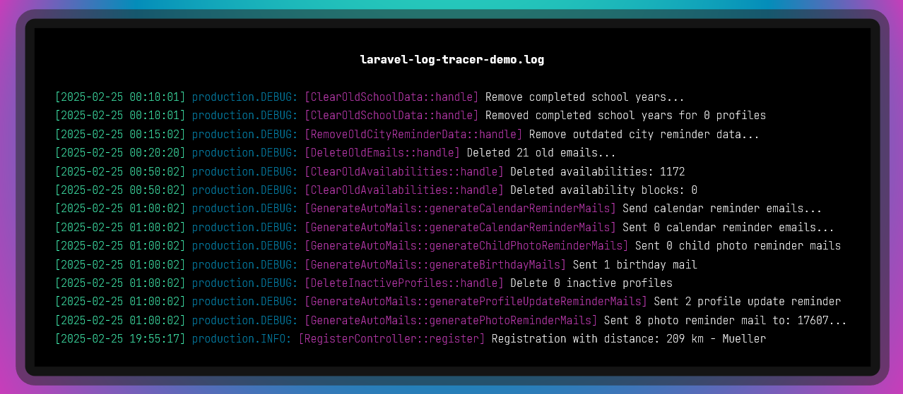

# Laravel Log Tracer

[](https://packagist.org/packages/dtvmedia/laravel-log-tracer)
[](https://github.com/dtvmedia/laravel-log-tracer/actions?query=workflow%3Arun-tests+branch%3Amain)
[](https://github.com/dtvmedia/laravel-log-tracer/actions?query=workflow%3A"Fix+PHP+code+style+issues"+branch%3Amain)
[](https://packagist.org/packages/dtvmedia/laravel-log-tracer)

🔍 A simple package for enhancing Laravel logging by adding the source from where the log was triggered, making it easier to trace the origin of log entries.



## Features:

- Adds the origin to each log entry
- Works seamlessly with Laravel's default logging configuration
- Supports custom formats

## Installation

You can install the package via composer:

```bash
composer require dtvmedia/laravel-log-tracer
```

You can publish the config file with:

```bash
php artisan vendor:publish --tag="laravel-log-tracer-config"
```

This is the contents of the published config file:

```php
<?php

return [

    /*
    |--------------------------------------------------------------------------
    | Format string for the log messages
    |--------------------------------------------------------------------------
    |
    | Available placeholder:
    | - {{class_basename}}
    | - {{method}}
    | - {{file}}
    | - {{line}}
    | - {{message}}
    |
    */

    'format' => '[{{class_basename}}::{{method}}] {{message}}',

    /*
    |--------------------------------------------------------------------------
    | Ignore Exceptions
    |--------------------------------------------------------------------------
    |
    | This option determines whether detected exceptions should be ignored
    | for further processing. When set to true, any log message identified as
    | an exception will not include the additional log trace.
    |
    */

    'ignore_exceptions' => true,

];
```

## Testing

```bash
composer test
```

## Changelog

Please see [CHANGELOG](CHANGELOG.md) for more information on what has changed recently.

## Contributing

Please see [CONTRIBUTING](CONTRIBUTING.md) for details.

## Security Vulnerabilities

Please review [our security policy](../../security/policy) on how to report security vulnerabilities.

## Credits

- [Dominique Heinelt](https://github.com/dtvmedia)
- [All Contributors](../../contributors)

## License

The MIT License (MIT). Please see [License File](LICENSE.md) for more information.
